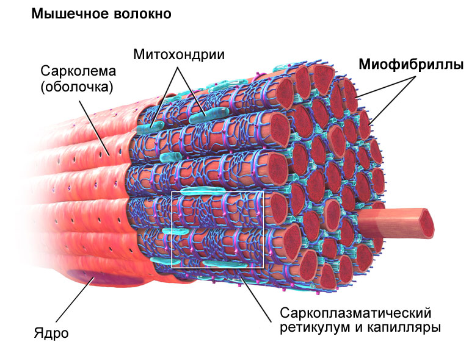

# Качалочка FAQ 🌐 👽

---

# Содержание 🚩 

### 1. [Некоторые термины 📋](#terminology)

1. [Прогрессия нагрузок](#Прогрессия_нагрузок)
2. [Проходка](#Проходка)
3. [Отказ](#Отказ)
4. [Суперкомпенсация](#Суперкомпенсация)
5. [Периодизация тренировочного плана](#Периодизация_тренировочного_плана)
6. [Микроцикл](#Микроцикл)
7. [Мезоцикл](#Мезоцикл)
8. [Макроцикл](#Макроцикл)
9. [Рабочий вес](#Рабочий_вес)

   [Сеты](#Сеты)
    1. [Прямой сет](#Прямой_сет)
    2. [Дроп-сет](#Дроп_сет)
    3. [Суперсет](#Суперсет)
    4. [Отдых-пауза](#Отдых_пауза)
    5. [Гигантские сеты](#Гигантские_сеты)
    6. [Негативная фаза](#Негативная_фаза)
    7. [Сравнение сетов](#сравнение_сетов)

---

### 3. [Вопросы ❓](#questions)

1. [Базовые принципы для набора массы](#базовые_принципы_для_набора_массы)
2. [Почему периодизация работает?](#почему_периодизация_работает)
3. [Почему микро- и мезоциклы?](#почему_микро_и_мезоциклы)
4. [Когда делать проходки?](#когда_делать_проходки)

---

### 2. [Биология 🧠](#biology)

1. [Почему мышцы прогрессируют нелинейно и привыкают к нагрузке?](#почему_мышцы_прогрессируют_нелинейно_и_привыкают_к_нагрузке)
2. [Как работает суперкомпенсация?](#как_работает_суперкомпенсация)
3. [Почему организм запасает больше чем нужно ?](#почему_организм_запасает_больше_чем_нужно)
4. [Строение мышц](#строение_мышц)
5. [Синтез белка Как мышцы «строят себя»](#синтез_белка_как_мышцы_строят_себя)
6. [Как правильный план тренировок активизирует рост](#как_правильный_план_тренировок_активизирует_рост)

---

### 4. [Тренировки 🏋](#trainings)

1. [Пример 6-недельного мезоцикла для набора массы](#пример_6_недельного_мезоцикла_для_набора_массы)
2. [Текущий сплит](#текущий_сплит)

#### [Тренировки ног](#тренировки_ног)
1. [Тренировка ног №1](#тренировка_ног_1)

---

# Термины 📋 

##### 1. _**Прогрессия нагрузок**_ 

Это постепенное увеличение нагрузки для стимуляции роста мышц и силы. Основные способы прогрессии:

1. Увеличение веса снаряда.
2. Увеличение количества повторений.
3. Увеличение количества подходов.
4. Сокращение отдыха между подходами. Это увеличит интенсивность тренировки.

##### 2. _**Проходка**_ 

Это тест на максимальный вес (1ПМ — один повторный максимум) в упражнении. Она используется для оценки текущего уровня
силы и корректировки плана. Однако проходки не стоит делать часто, так как они сильно нагружают ЦНС (центральную нервную
систему).

##### 3. _**Отказ**_ 

Состояние, когда вы не можете выполнить еще одно повторение с правильной техникой.

##### 4. _**Суперкомпенсация**_ 

Фаза восстановления, когда организм становится сильнее после тренировки.\

##### 5. _**Периодизация тренировочного плана**_ 

Долгосрочное планирование развития определенных характеристик, оно имеет конкретную цель и ориентир по времени.
Периодизация тренировок формирует цикл, в течение которого происходят процессы, направленные на определенный результат.

##### 6. _**Микроцикл**_ 

Короткий период тренировок (обычно 1-2 недели), в рамках которого вы работаете над конкретными целями.

##### 7. _**Мезоцикл**_ 

Более длительный период (4-8 недель), включающий несколько микроциклов.

##### 8. _**Макроцикл**_ 

Самый длинный период (1 год), включающий несколько макроциклов.

##### 9. _**Рабочий вес**_ 

Вес отягощения (снаряда), с которым ты сможешь выполнить нужное количество повторений, соблюдая технику, чтобы во время
последнего повторения наступал мышечный отказ, либо до его наступления оставалось одно повторение, максимум два.

---

## Сеты 

##### 1. _**Прямой сет**_ 

Сет, суть которого заключается в выполнении заданного количества подходов и повторений с фиксированным весом.

- Пример: 4 подхода по 8 повторений в жиме лежа с 80 кг.

- Плюсы:
    - Простота и предсказуемость.
    - Позволяет точно отслеживать прогрессию (вес/повторы).
    - Идеально для новичков и силовых циклов.
- Минусы:
    - Мышцы адаптируются через 4-6 недель → прогресс замедляется.
    - Не создает экстремального метаболического стресса.

> База для любого плана, развитие силы и миофибриллярной гипертрофии.

##### 2. _**Дроп-сет**_ 

Сет, при котором после отказа в основном подходе ты уменьшаешь вес и продолжаешь подход без отдыха.

- Пример:
    - Жим гантелей на плечи: 10 повторений с 20 кг → отказ → сразу 15 кг → 8 повторений → 10 кг → 5 повторений.
- Физиология:
    - Метаболический стресс: накопление лактата и ионов H+ → выброс гормона роста.
    - Активация сателлитных клеток: экстремальное утомление повреждает волокна → запускается гипертрофия.
- Плюсы:
    - Максимальная «накачка» (саркоплазматическая гипертрофия).
    - Экономия времени (больше объема за подход).
- Минусы:
    - Сильно нагружает ЦНС.
    - Риск перетренированности при частом использовании.

##### 3. _**Суперсет**_ 

Сет, суть которого заключается в выполнении двух упражнений подряд без отдыха.

- Типы:
    1. На одну группу мышц (например, жим лежа + разводка гантелей).
    2. На антагонисты (бицепс + трицепс, грудь + спина).
- Физиология:
    - Повышение интенсивности: Больший расход гликогена → рост выносливости.
    - Усиление кровотока: Антагонисты «выдавливают» кровь друг в друга → пампинг.
- Плюсы:
    - Экономит время.
    - Увеличивает плотность тренировки.
- Минусы:
    - Снижает рабочий вес в силовых упражнениях.

##### 4. _**Отдых-пауза**_ 

Сет, суть которого заключается в выполнении нескольких подходов до отказа с коротким отдыхом между каждым подходом.

- Пример: подтягивания с весом: 8 повторений → отдых 15 сек → 4 повторения → отдых 15 сек → 2 повторения.
- Физиология:
    - Рекрутирование высоко пороговых волокон: После отказа ЦНС «добирает» резервные волокна.
    - Синтез белка: Сигнал mTOR усиливается из-за экстремального стресса.
- Плюсы:
    - Позволяет поднять объем без увеличения веса.
    - Эффективен при работе с малым оборудованием (гантели, турник).
- Минусы:
    - Высокий риск перетренированности.

##### 5. _**Гигантские сеты**_ 

Сет из 4-6 упражнений на одну группу мышц без отдыха.

- Пример для груди:
    1. Жим штанги лежа → 12 повторов.
    2. Разводка гантелей → 15 повторов.
    3. Отжимания на брусьях → 10 повторов.
    4. Пуловер → 12 повторов.
    5. Отдых 2-3 минуты → повторить 3 круга.
- Физиология:
    - Ишемия и гипоксия: Прекращение кровотока в мышце → выброс анаболических факторов.
    - Повреждение волокон всех типов: И медленные, и быстрые.
- Плюсы:
    - Максимальная «забитость» мышцы.
    - Прокачивает слабые зоны.
- Минусы:
    - Требует хорошей выносливости.
    - Не подходит для базовых упражнений (риск травм).

##### 6. _**Негативная фаза**_ 

Сет, при котором необходимо акцентироваться на эксцентрической фазе (опускание веса), которая длится 3-5 секунд, при
выполнении каждого повторения.

- Пример: подъем штанги на бицепс: 1 сек на подъем, 4 сек на опускание.
- Физиология:
    - Больше микротравм: Эксцентрика сильнее повреждает волокна → больше сателлитных клеток.
    - Сила: Увеличивает миофибриллярную гипертрофию.
- Плюсы:
    - Прокачивает слабые точки в амплитуде.
    - Позволяет работать с большим весом (на негативе можно опустить больше, чем поднять).
- Минусы:
    - Сильная крепатура.
    - Риск травм при нарушении техники.

### Сравнение сетов 

| Метод           | Преимущества                                                   | Недостатки                       | Когда использовать                  |
|:----------------|:---------------------------------------------------------------|:---------------------------------|:------------------------------------|
| Прямой сет      | Прогрессия веса, сила, стабильность                            | Риск адаптации мышц              | Базовые упражнения, силовые циклы   |
| Дроп-сеты       | Максимальный пампинг, экономия времени                         | Перегрузка ЦНС, риск катаболизма | Завершение тренировки, мелкие мышцы |
| Суперсеты       | Интенсивность, выносливость                                    | Снижение рабочего веса           | Метаболические тренировки           |
| Отдых-пауза     | Рекрутирование высоко пороговых волокон, развитие выносливости | Крепатура, быстрая утомляемость  | Шокирование мышц                    |
| Гигантские сеты | Всесторонняя проработка                                        | Утомляемость, требует опыта      | Шокирование мышц, преодоление плато |
| Негативная фаза | Увеличение силы, акцент на слабые точки                        | Крепатура, сложная техника       | Силовые мезоциклы                   |

---

# Вопросы ❓ 

### Базовые принципы для набора массы 

1. Прогрессия нагрузок
   Объем (количество подходов × повторений × вес) — ключевой фактор роста мышц.
   Увеличивай объём постепенно: +1 подход, +1 повторение или +2.5 кг в упражнении каждую неделю.
2. Частота тренировок
   Каждую мышечную группу нужно тренировать 2 раза в неделю для оптимального роста.
3. Интенсивность
   Работайте в диапазоне 6-12 повторений для гипертрофии.
   Для силы: 3-6 повторений с весами 80-90% от 1ПМ (рабочий вес).

---

### Почему периодизация работает? 

- _**Суперкомпенсация**_: После нагрузки организм восстанавливается с «запасом», становясь сильнее. Циклы помогают
  «поймать» эту фазу.
- _**Избегание плато**_: Смена стимулов не дает телу адаптироваться и остановить прогресс.
- _**Психологическая разгрузка**_: Чередование тяжелых и легких недель снижает эмоциональное выгорание.

---

### Почему микро- и мезоциклы? 

1. **Физиология адаптации.** Мышцы и нервная система адаптируются к нагрузкам нелинейно. Если давать одинаковый стимул
   неделями, прогресс замедлится из-за привыкания. Такие циклы позволяют:
    1. Шокировать мышцы за счет смены интенсивности, объема и упражнений.
    2. Управлять утомлением, чередуя тяжелые и легкие периоды.
    3. Планировать пики формы (например, к соревнованиям).
2. **Исторический контекст.**
    - Советская школа тяжелой атлетики (1950-е): Тренеры вроде Романа Плюкфельдера заметили, что спортсмены
      прогрессируют быстрее, если менять нагрузку каждые 2-4 недели. Это легло в основу теории периодизации.
    - Исследования доктора Тудора Бомпы (1970-е): Он систематизировал идею циклов, разделив тренировки на фазы:
      подготовительная, базовая, соревновательная, восстановительная.
3. **Практическая эффективность.**
    - Микроцикл (1-2 недели): Позволяет фокусироваться на конкретной цели (например, «неделя объема» или «неделя
      интенсивности»).
    - Мезоцикл (4-8 недель): Объединяет микроциклы для достижения более масштабной задачи (гипертрофия, сила,
      выносливость).
    - Макроцикл (6-12 месяцев): Годовой план, включающий все этапы подготовки.

---

### Когда делать проходки? 

Проходки (тесты на 1ПМ) — это стресс для ЦНС и мышц, поэтому их нужно встраивать в циклы аккуратно.

#### Правила:

- **В конце мезоцикла.**

> Пример: После 6 недель работы на гипертрофию проведите проходку, чтобы обновить 1ПМ и скорректировать веса для
> следующего мезоцикла.

- **Перед разгрузочной неделей.**

> Сделайте проходку на 5-6 неделе мезоцикла, а затем перейдите к легким тренировкам для восстановления.

- **Не чаще 1 раза в 8-12 недель.**

> Частые проходки приводят к перетренированности. Исключение — опытные атлеты, готовящиеся к соревнованиям.
---

# Биология 🧠 

### Почему мышцы прогрессируют нелинейно и привыкают к нагрузке? 

#### Причины:

- Адаптационный механизм гомеостаза

> Тело стремится сохранить баланс (гомеостаз). Когда ты даёшь стресс (тренировку), организм воспринимает его как угрозу
> и начинает адаптироваться, чтобы в следующий раз справиться с нагрузкой эффективнее. Но эта адаптация имеет пределы:
>  1. **Фаза быстрого прогресса**: В первые недели тренировок нейромышечная система старается включить больше мышечных
      волокон (повышается КПД движений), а мышцы накапливают гликоген и воду. Это создает иллюзию резкого роста силы и
      объема.
>  2. **Фаза плато**: Через 6-8 недель тело адаптируется к конкретной нагрузке. Мышцы и ЦНС больше не видят угрозы —
      рост замедляется.

- Разная скорость адаптации систем организма:

> 1. **Мышцы:** Быстро адаптируются к объему (количество подходов/повторений), но медленно — к интенсивности (вес).
>  2. **Связки и сухожилия:** Укрепляются в 3-5 раз медленнее мышц.
>  3. **ЦНС (центральная нервная система):** Учится включать высокопороговые двигательные единицы (силовые мышечные
      волокна), но ей нужен отдых между тяжелыми тренировками.
---

### Как работает суперкомпенсация? 

#### Фазы суперкомпенсации:

1. Фаза разрушения (тренировка):
    - Мышечные волокна получают микротравмы.
    - Истощаются запасы гликогена и креатинфосфата.
    - Повышается уровень кортизола (гормон стресса).
2. Фаза восстановления (24-72 часа):
    - Тело восполняет энергию (гликоген) и ремонтирует мышцы.
    - Уровень ресурсов возвращается к исходному.
3. Фаза суперкомпенсации (24-48 часов после восстановления):
    - Организм «запасается»:
        - Гликоген накапливается на 120-150% от исходного уровня.
        - Синтез белка ускоряется → мышцы становятся больше и сильнее.
        - Увеличивается плотность митохондрий («энергостанций» клеток).
    - Это окно длится 1-3 дня — идеальное время для следующей тренировки.
4. Фаза угасания:
    - Если нагрузка не повторяется, тело возвращается к исходному уровню (зачем тратить ресурсы?).

---

### Почему организм запасает больше, чем нужно? 

- _**Эволюционная причина:**_ Тело готовится к повторному стрессу, чтобы выжить. Например, древний человек после погони
  за добычей должен был быть готов к новой охоте.
- _**Биохимия:**_
    - **Активация mTOR-пути** — ключевого механизма роста мышц. Силовой тренинг запускает сигналы, которые «приказывают»
      клеткам синтезировать больше белка.
    - **Повышение чувствительности к инсулину** — мышцы активнее захватывают глюкозу и аминокислоты.
    - **Выброс анаболических гормонов** (тестостерон, IGF-1) → стимуляция гипертрофии.

---

### Строение мышц 

А. Иерархия мышечной ткани:

1. Мышечное волокно (клетка):
    - Основная единица мышцы.
    - Типы волокон:
        - Тип I (медленные): Выносливость, низкая утомляемость, мало гипертрофируются.
        - Тип IIa (быстрые окислительно-гликолитические): Сила + выносливость.
        - Тип IIx (быстрые гликолитические): Максимальная сила и мощность, но быстро устают.

   Чем больше в мышце волокон Типа II — тем выше потенциал к росту.
2. Миофибриллы:
    - «Нити» внутри волокна, состоящие из актина и миозина — белков, которые сокращают мышцу.
    - Гипертрофия происходит за счет увеличения количества миофибрилл (миофибриллярная гипертрофия).
3. Саркоплазма:
    - Жидкость вокруг миофибрилл, содержит гликоген, АТФ, креатинфосфат, митохондрии.
    - Увеличение саркоплазмы — саркоплазматическая гипертрофия (дает объем, но не силу).
4. Сарколемма:
    - Мембрана мышечного волокна. Через нее поступают питательные вещества и сигналы от нервов.
5. Сателлитные клетки:
    - «Спящие» клетки-ремонтники. Активируются при микротравмах и сливаются с поврежденными волокнами, чтобы
      восстанавливать их и увеличить ядра клетки.

---

### Синтез белка: Как мышцы «строят себя» 

После тренировки в мышцах запускается цепь реакций:

1. Сигнал от тренировки:
    - Повреждение волокон → выделение факторов роста (IGF-1, тестостерон).
2. Активация ДНК:
    - Сигналы от mTOR и гормонов «включают» гены, ответственные за синтез белка.
3. Транскрипция mRNA:
    - ДНК копируется в матричную РНК (mRNA), которая выходит из ядра.
4. Трансляция на рибосомах:
    - mRNA «читается» рибосомами → аминокислоты соединяются в цепочки (новые белки).
5. Сборка миофибрилл:
    - Белки (актин, миозин) формируют новые нити → мышца утолщается.

---

### Как правильный план тренировок активизирует рост 

#### А. Сочетание разных типов нагрузки:

1. День 1: Механическое напряжение
    - Тяжелые веса (3-6 повторений), базовые упражнения (присед, жим, становая).
    - Цель: Активация mTOR и миофибриллярная гипертрофия.
2. День 2: Метаболический стресс
    - Многоповторка (12-15 повторений), суперсеты, дроп-сеты.
    - Цель: Саркоплазматическая гипертрофия + выброс гормонов.
3. День 3: Комбинированная нагрузка
    - Умеренные веса (8-12 повторений) + упражнения на слабые группы.

#### Б. Управление объёмом и частотой:

1. Объем (подходы × повторения):
    - Оптимально 10-20 подходов на группу мышц в неделю.
2. Частота:
    - Старайся тренировать каждую группу 2 раза в неделю, чтобы поддерживать синтез белка на пике.

#### В. Периодизация:

- Неделя 1: Высокий объем (15-20 подходов, 8-12 повторений).
- Неделя 2: Высокая интенсивность (5-8 подходов, 3-6 повторений).
- Неделя 3: Разгрузка (снижение объема на 50%).

> Это не дает организму адаптироваться к нагрузке.
---

# Тренировки 🏋 

### Пример 6-недельного мезоцикла для набора массы: 

### **Примерная структура / шаблон:**

- Недели 1-2: Высокий объем (гипертрофия).
- Недели 3-4: Смешанная нагрузка (сила + масса).
- Недели 5-6: Пиковая интенсивность + разгрузка (восстановление).

### **Пробуем следующую схему:**

- **Неделя 1**: Гипертрофия + выносливость
    - 70% от 1ПМ
    - 8-12 повторений
    - в отказ последние 1-2 подхода
- **Неделя 2-3**: Сила + масса
    - 80% от 1ПМ
    - 6-8 повторений
    - в отказ последние 1-2 подхода
- **Неделя 4-5**: Пик
    - 90-95% от 1ПМ
    - каждый подход в отказ
    - 3-6 повторений
    - На последней неделе проходка

> Если в этот период не сдох в качалке и нет судорог от каждого мышечного движения, то зря тренил

- **Неделя 6**: Восстановление (40% от 1ПМ, высокий объём, 12-15 повторений).

---

### **Текущий сплит:** 

1. Грудь, трицепс, плечи
2. Спина, бицепс, предплечья
3. Ноги, ноги, ноги

---

## Тренировки Ног 

### Тренировка ног №1 

1. Разминка
2. Бег 5 минут
3. Присед со штангой/жим ногами (база, квадрицепсы + ягодицы)
    - Разминка: 1×10 (гриф), 1×8 (50%), 1×5 (70%).
    - Рабочие подходы: 3×6-8.
4. Румынская тяга с маленьким весом (акцент на растяжке и расслаблении после приседа/жима) (бицепс бедра + ягодицы)
    - 3×6-10.
5. Болгарские выпады (квадрицепсы, ягодицы, икры, стабилизаторы). Второе многосуставное упражнение (румынскую тягу не считаем, так как там маленький вес, просто пустой гриф), выпады включают вообще все мышцы ноги.
    - 3-4×10-12 на ногу.
6. Разгибы (квадрицепсы + ягодицы)
    - 4×10-12.
7. Сгибания ног лежа (бицепс бедра)
     - 4×12-15.
8. Подъемы на носки (икры)
    - 4×15-20.
9. Растяжка
